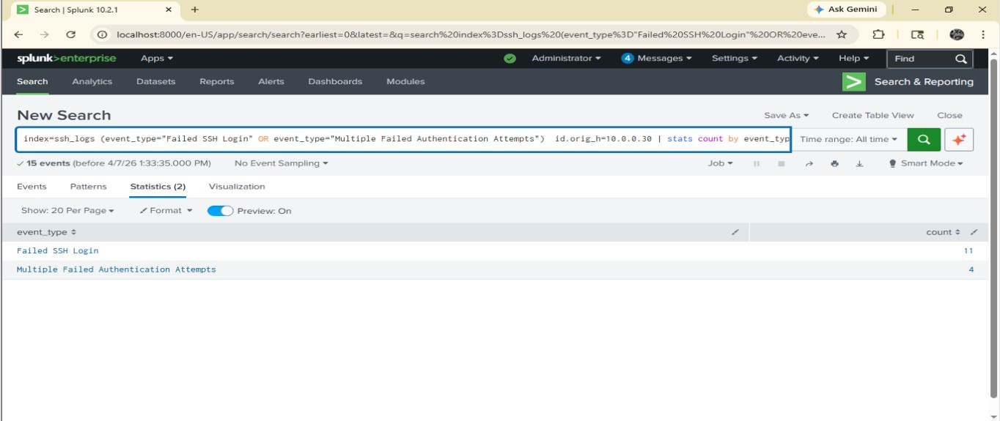
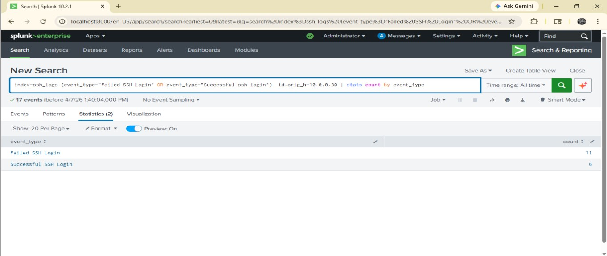
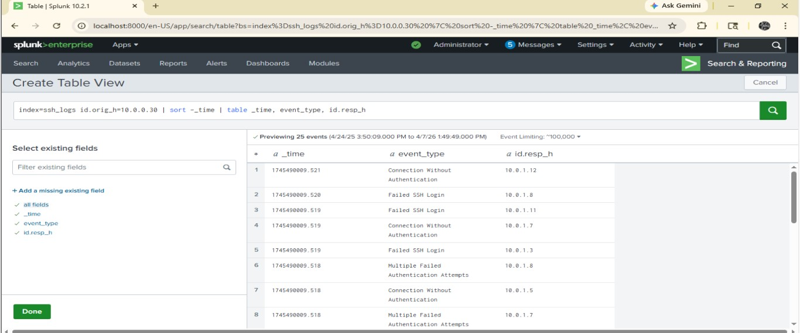

# 🚨 Incident Response using Splunk

## 📌 Objective
This project simulates a real-world SOC investigation of an SSH brute-force attack using Splunk.

## 📌 Note
This incident response project is based on Splunk log analysis, where SSH authentication logs were investigated to identify brute-force attacks and potential system compromise.

---

## ⚙️ Tools Used
- Splunk SIEM  
- SSH Logs (JSON)

---

## 🧪 Investigation Steps

### Step 1: Attacker Identification
Identified IP with highest failed login attempts.

📸  

---

### Step 2: Brute Force Detection
Detected repeated failed authentication attempts.

📸  

---

### Step 3: Compromise Check
Observed successful login after multiple failed attempts.

📸  

---

### Step 4: Timeline Analysis
Tracked attack progression using log timestamps.

📸  

---

## 🚨 Findings

- Attacker IP: 10.0.0.30  
- Failed Attempts: 11  
- Successful Logins: 6  
- Attack Type: SSH Brute Force  

---

## ⚠️ Conclusion

The attacker successfully gained unauthorized access after multiple failed login attempts, confirming a brute-force compromise.

---

## 🛡️ Recommendations

- Enable Multi-Factor Authentication (MFA)  
- Implement account lockout policies  
- Monitor login attempts  
- Block malicious IP addresses  

